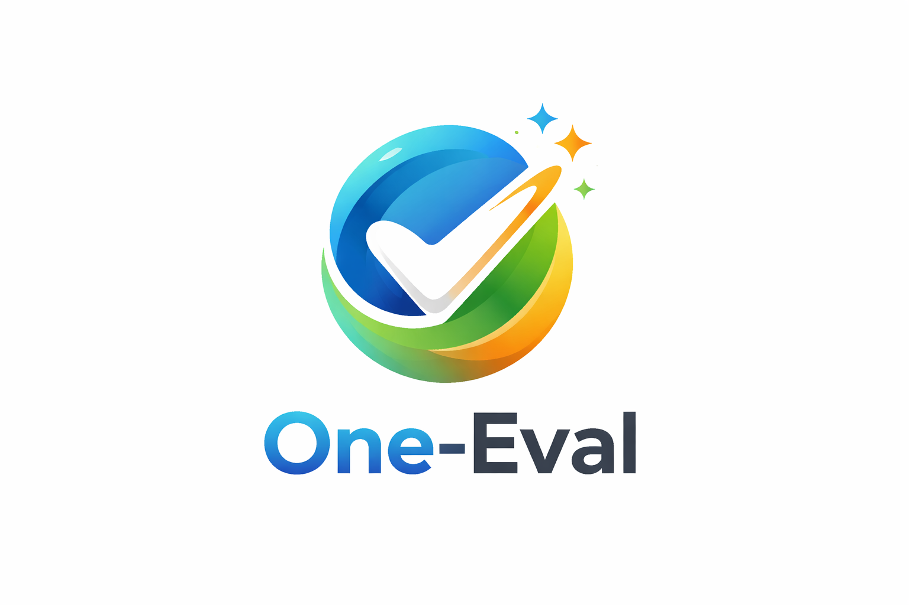
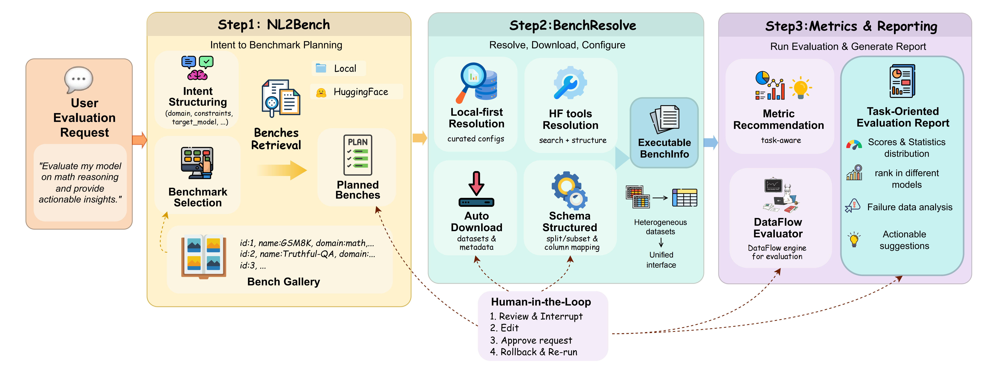
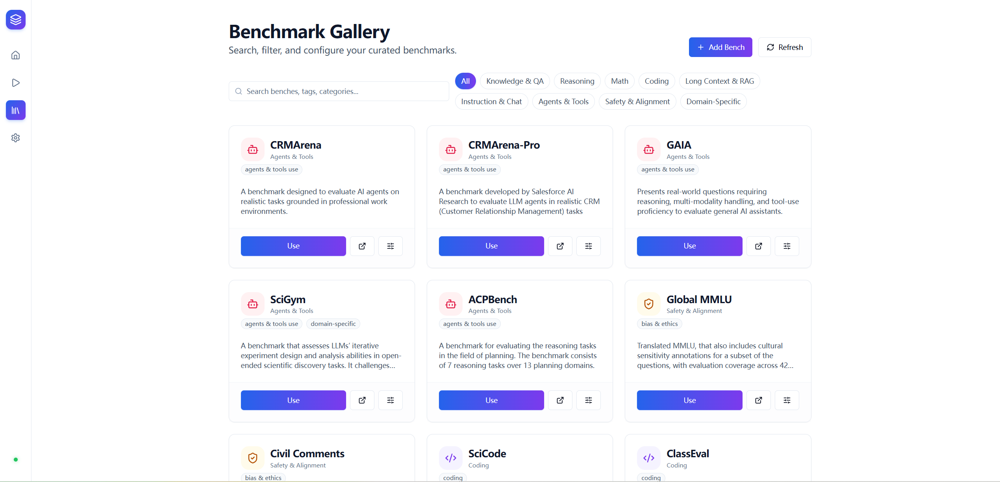

# One-Eval

<div align="center">
  <!-- TODO: Add Project Logo Here -->
  

[](./LICENSE)
[](https://deepwiki.com/OpenDCAI/One-Eval)
[](https://github.com/OpenDCAI/One-Eval)

<!-- TODO: Uncomment after adding ArXiv link -->
<!-- [](https://arxiv.org/abs/xxxx.xxxxx) -->

<!-- TODO: Uncomment after adding WeChat Group QR link -->
<!-- [](YOUR_WECHAT_QR_LINK) -->

</div>

One-Eval is an automated Agent-based evaluation framework for Large Language Models, designed to achieve **NL2Eval**: automatically orchestrating evaluation workflows and generating reports from natural language requirements.  
Built on [DataFlow](https://github.com/OpenDCAI/DataFlow) and [LangGraph](https://github.com/langchain-ai/langgraph), it emphasizes a traceable, interruptible, and scalable evaluation loop.

English | [简体中文](./README_zh.md)

## 📰 1. News

- **[2026-03] 🎉 One-Eval (v0.1.0) is officially open-sourced!**  
  We released the first version, supporting full-link automation from natural language to evaluation reports (NL2Eval). Say goodbye to tedious manual scripts and make LLM evaluation as simple, intuitive, and controllable as chatting. Welcome to Star 🌟 and follow!

## 🔍 2. Overview

Traditional evaluation often faces pain points such as complex scripts, fragmented processes, and difficulty in reuse. One-Eval reconstructs evaluation into a **graph-based execution process (Graph / Node / State)**, dedicated to creating the next generation of interactive evaluation experience:

- 🗣️ **NL2Eval**: Just input a natural language goal (e.g., "Evaluate the model's performance on math reasoning tasks"), and the system automatically parses the intent and plans the execution path.
- 🧩 **End-to-End Automation**: Automatically completes benchmark recommendation, data preparation, inference execution, metric matching, scoring, and multi-dimensional report generation.
- ⏸️ **Human-in-the-Loop**: Supports interruption and human intervention at key nodes (such as benchmark selection, result review), facilitating real-time adjustment of evaluation strategies based on feedback.
- 📊 **Scalable Architecture**: Based on the DataFlow operator system and LangGraph state management, it easily integrates private datasets and custom metrics.

<!-- TODO: Add One-Eval Framework Diagram Here -->


## ⚡ 3. Quick Start

### 3.1 Installation (Recommended)

We provide two environment management methods: Conda and uv. Choose one to get started quickly:

#### Option A: Conda
```bash
conda create -n one-eval python=3.10 -y
conda activate one-eval
pip install -e .
```

#### Option B: uv
```bash
uv venv
uv pip install -e .
```

### 3.2 Start Services

One-Eval adopts a separation of frontend and backend architecture. Please start the backend API and frontend interface respectively.

#### ① Start Backend (FastAPI)
```bash
uvicorn one_eval.server.app:app --host 0.0.0.0 --port 8000
```

#### ② Start Frontend (Vite + React)
```bash
cd one-eval-web
npm install
npm run dev
```
> Visit http://localhost:5173 to start interactive evaluation.

### 3.3 Minimal Code Mode (Developer Mode)

If you prefer to call directly in code, you can run the built-in complete workflow example:  
[workflow_all.py](./one_eval/graph/workflow_all.py)

```bash
# Example: Initiate a reasoning capability evaluation directly via command line
python -m one_eval.graph.workflow_all "I want to evaluate my model's performance on Reasoning tasks"
```

This Graph demonstrates the complete closed loop from Query parsing to report generation. You are welcome to develop and extend nodes based on this.

## 🗂️ 4. Bench Gallery

One-Eval has a built-in rich **Bench Gallery** for unified management of meta-information of various evaluation benchmarks (such as task type, data format, Prompt template).

Currently covering mainstream text-only capability dimensions (no complex sandbox environment required):
- 🧮 **Reasoning**: MATH, GSM8K, BBH, AIME...
- 🌐 **General Knowledge**: MMLU, CEval, CMMLU...
- 🔧 **Instruction Following**: IFEval...

<!-- TODO: Add Bench Gallery Image Here -->


## 📮 5. Contact & Citation

If you are interested in this project, or have any questions or suggestions, please contact us via Issue or join our WeChat group.

*The tutorials are part of the DataFlow series, and the One-Eval series tutorials are currently being recorded.*

<div align="center">
  
</div>

<!-- If you use One-Eval in your research, please cite our work: -->

<!-- TODO: Add Citation BibTeX -->
<!--
## Citation
```bibtex
@misc{one_eval_2026,
  title={One-Eval: An Agentic Framework for NL2Evaluation},
  author={One-Eval Team},
  year={2026},
  publisher={GitHub},
  journal={GitHub repository},
  howpublished={\url{https://github.com/OpenDCAI/One-Eval}},
}
```
-->
